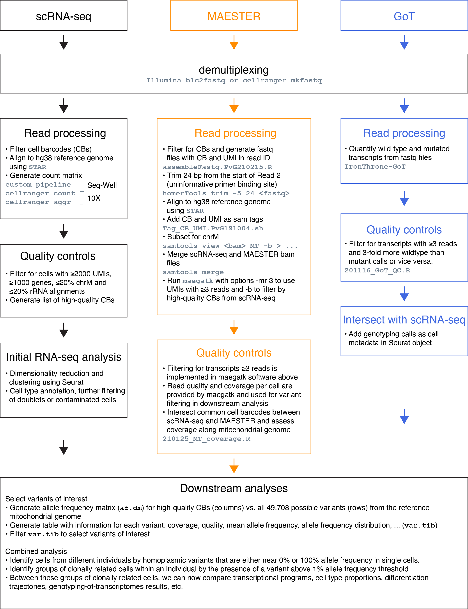

# MAESTER-2021

## Outline
A collection of scripts for the analysis of MAESTER data. This outline (also Supplemental Figure 5 in the paper) shows how scripts are used.

## 1 Pre-processing
Process sequencing reads and perform quality controls.

Filter for cell barcodes (CBs) and generate fastq files with CB and unique molecular identifiers (UMIs) from the Read 1 fastq in the read ID of the Read 2 fastq:
[assembleFastq.PvG210215.R](1_Pre-processing/assembleFastq.PvG210215.R)

After alignment, take the bam file and add the CB and UMI from the read ID as bam tags:
[Tag_CB_UMI.PvG191004.sh](1_Pre-processing/Tag_CB_UMI.PvG191004.sh)

Process IronThrone-GoT summary tables by doing additional QC and generating tables of wild-type/mutant cells:
[201116_GoT_QC.R](1_Pre-processing/201116_GoT_QC.R)

Take MAEGATK output and plot coverage along the mitochondrial genome:
[210124_MT_coverage.R](1_Pre-processing/210124_MT_coverage.R)

## 2 Downstream analyses
These scripts were used for downstream analysis of the combined scRNA-seq, MAESTER and GoT data.

#### 1. Cell line mixing: clustering and cleanup
The same cells, a mixture of K562 and BT142, were analyzed using Seq-Well S^3 and 10X 3' v3 scRNA-seq protocols. These scripts were used to cluster and remove contaminated cells with decontX:\
[200915_TenX_CellLineMix_decontX.R](2_Downstream_analyses/200915_TenX_CellLineMix_decontX.R)\
[201101_SW_CellLineMix_decontX.R](2_Downstream_analyses/201101_SW_CellLineMix_decontX.R)

#### 2. Cell line mixing: variants
These scripts were used to classify cells as either K562 or BT142 based on mitochondrial variants, and to compare this to classification based on RNA-seq:\
[201101_SW_CellLineMix_variants.R](2_Downstream_analyses/201101_SW_CellLineMix_variants.R)\
[201129_TenX_CellLineMix_variants.R](2_Downstream_analyses/201129_TenX_CellLineMix_variants.R)

These scripts were used to identify clonal structure in K562 cells of both cell line mixing experiments:\
[201119_SW_K562_clones.R](2_Downstream_analyses/201119_SW_K562_clones.R)\
[201203_TenX_K562_clones.R](2_Downstream_analyses/201203_TenX_K562_clones.R)

#### 3. Patient 10 Diagnosis
These scripts were used to analyze cells from the uninvolved bone marrow of Patient 10 (aka BPDCN712) when he was diagnosed with BPDCN. This includes UMAP visualization, identification of informative variants, generating a heatmap of variant allele frequencies, and assessing cell type proportions:\
[210123_BPDCN712_UMAP.R](2_Downstream_analyses/210123_BPDCN712_UMAP.R)\
[210124_Variants_Of_Interest.R](2_Downstream_analyses/210124_Variants_Of_Interest.R)\
[210204_LineageBias.R](2_Downstream_analyses/210204_LineageBias.R)

#### 4. TET2 mutations
This script was used to quantify transcripts with TET2 mutations, that were detected by Genotyping of Transcriptomes, in clones that were detected by MAESTER:\
[210201_Heatmap.R](2_Downstream_analyses/210201_Heatmap.R)

#### 5. Cytotoxic T Lymphocyte correlation
This script was used to correlate the transcriptomes of cytotoxic T lymphocytes (CTLs) within (intraclonal) and between (interclonal) clones that were detected by MAESTER:\
[210201_CTL_correlation.R](2_Downstream_analyses/210201_CTL_correlation.R)

#### 6. Trajectory analysis
This script was used to analyze the myeloid differentiation trajectory including the assignment of pseudotime values and assessment of the density of cells along the trajectory:\
[210209_Slingshot.R](2_Downstream_analyses/210209_Slingshot.R)

